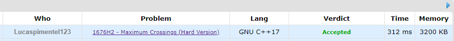
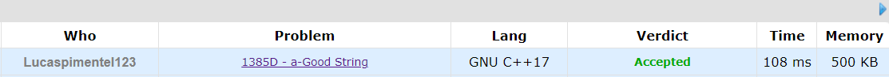
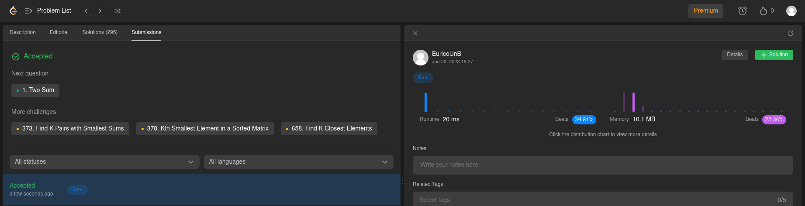
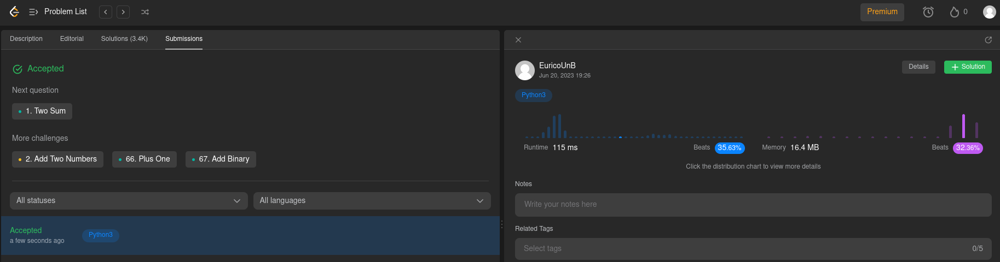
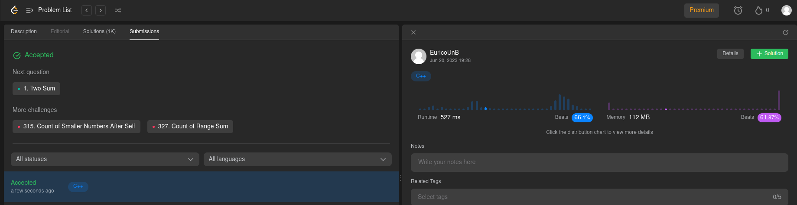

# NomedoProjeto

**Conteúdo da Disciplina**: Dividir e conquistar 

## Alunos

| Matrícula  | Aluno                        |
| ---------- | ---------------------------- |
| 19/0016663 | Lucas Pimentel Quintão       |
| 20/0017519 | Eurico Menezes de Abreu Neto |

## Sobre

Para este projeto da disciplina optamos por fazer questões de Programação Competitiva de diferentes dificuldades, utilizando os sites CodeForces e LeetCode. As questões escolhidas foram:

- 1676H2 - [Maximum Crossings (Hard Version)](https://codeforces.com/problemset/problem/1676/H2)
- 1385D - [a-Good String](https://codeforces.com/problemset/problem/1385/D)
- [multiply-strings](https://leetcode.com/problems/multiply-strings/description/)
- [find-k-th-smallest-pair-distance](https://leetcode.com/problems/find-k-th-smallest-pair-distance/)
- [reverse-pairs](https://leetcode.com/problems/reverse-pairs)

## Screenshots

### Accepteds

## Instalação

**Linguagem**: xxxxxx 
**Framework**: (caso exista) 
Descreva os pré-requisitos para rodar o seu projeto e os comandos necessários.

## Uso

Explique como usar seu projeto caso haja algum passo a passo após o comando de execução.

## Vídeo

[link]([https://leetcode.com/problems/reverse-pairs](https://unbbr-my.sharepoint.com/:v:/g/personal/190016663_aluno_unb_br/EVR40lxVcm9CpQvztP1SMBABv2eJElq-pfZx5fAWqS9D8g?e=8dywd3)https://unbbr-my.sharepoint.com/:v:/g/personal/190016663_aluno_unb_br/EVR40lxVcm9CpQvztP1SMBABv2eJElq-pfZx5fAWqS9D8g?e=8dywd3)

